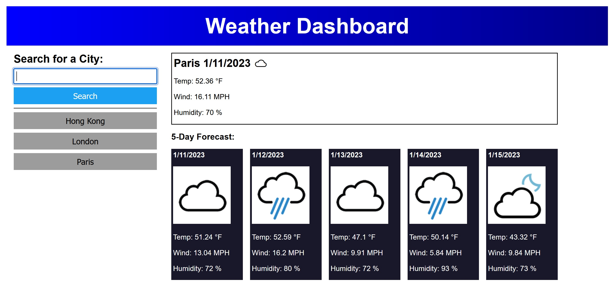

# Boot Camp - Module 6 Challenge - Server-Side APIs Challenge: Weather Dashboard

## About

A server-side API, web storage api, and JavaScript coding challenge for UConn Boot Camp.

## Description

For this project, I learned how to use the server-side API [OpenWeather](https://openweathermap.org/forecast5) and the Web Storage API (local storage) to build a weather dashboard application.

The application displays current and future weather conditions for any city that is searched for, as well as displays past searches.

If I had more time to work on this application, I would do the following:

- Learn about how to secure API keys (e.g., create a PHP wrapper around the API call and then call that wrapper with JavaScript)
- Write a function that capitalizes the string that is produced from the city search, perhaps using [charAt(), toUpperCase(), and slice()](https://flexiple.com/javascript/javascript-capitalize-first-letter/). Currently, the string is changed to upper case using the toUpperCase() method.
- Address what happens if the call(s) to the API fail.
- Refactor the displayWeather() function so that the daily weather at the top of the application displays on the page dynamically using appendChild() (as it is done in the displayForecast() function) instead of how it is currently done by updating the text content in the hardcoded HTML elements.
- Remove the displayWeather() function if/else statement that displays the current weather icons and refactor the code so that the API data is used to display the weather icons like it is done in the displayForecast() function.
- Refactor any repetitive code into reuseable functions.
- Add more comments to the JavaScript code for the sake of clarity.

## Technologies

HTML, CSS, JavaScript, OpenWeather API, Day.js API, Web Storage API, Git, GitHub, VS Code, Chrome, Firefox

## Screenshot

## Deployment

[GitHub Pages](https://kkarrwrites.github.io/boot-camp-module-06-challenge-weather-dashboard)

## License

This project is licensed under the MIT License.

## Resources

### OpenWeather Icons

- [StackOverflow - How to display openweathermap weather icon](https://stackoverflow.com/questions/44177417/how-to-display-openweathermap-weather-icon)
- [GitHub - openweathermap-api-icons by yuvraaaj](https://github.com/yuvraaaj/openweathermap-api-icons)
- [OpenWeather - Weather Conditions - Weather Icons](https://openweathermap.org/weather-conditions)
